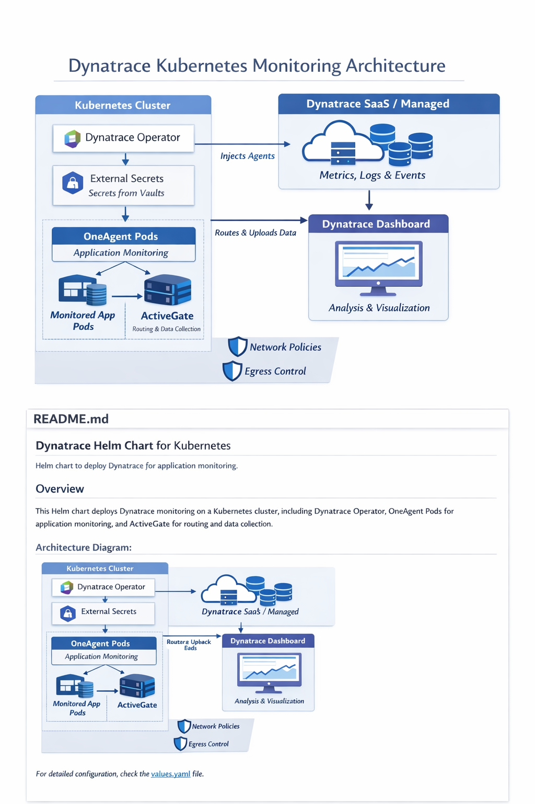

# Dynatrace Helm Chart for Kubernetes

This Helm chart deploys **Dynatrace monitoring** on a Kubernetes cluster, including the **Dynatrace Operator**, **OneAgent**, and **ActiveGate**. It provides full application monitoring, ActiveGate configuration, and secure networking using NetworkPolicies.

---

## Table of Contents

* [Overview](#overview)
* [Architecture Diagram](#architecture-diagram)
* [Prerequisites](#prerequisites)
* [Installation](#installation)
* [Configuration](#configuration)
* [Network Policies](#network-policies)
* [Dynakube Custom Resource](#dynakube-custom-resource)
* [External Secrets](#external-secrets)
* [Resources & Security](#resources--security)

---

## Overview

This Helm chart deploys:

* **Dynatrace Operator:** Handles deployment and management of Dynatrace components.
* **OneAgent:** Monitors applications and Kubernetes workloads.
* **ActiveGate:** Routes data to Dynatrace and enables cluster-level monitoring.
* **ExternalSecrets:** Optional integration with secret management solutions.

The chart is designed to be configurable via the `values.yaml` file and GitOps repositories.

---

## Architecture Diagram

<p align="center">
  
</p>

**Diagram Description:**

* **Dynatrace Operator:** Deploys & manages OneAgent & ActiveGate.
* **OneAgent Pods:** Injected into monitored namespaces to monitor applications.
* **ActiveGate:** Collects metrics and routes traffic to Dynatrace SaaS/Managed.
* **ExternalSecrets:** Provides API tokens securely to the Operator.
* **Dynatrace Dashboard:** Displays metrics, logs, and events.
* Network Policies and Egress Controls are applied for security.

---

## Prerequisites

* Kubernetes cluster version >= 1.21
* Helm 3.x
* Dynatrace environment URL and API token
* Optional: ExternalSecrets for secret management

---

## Installation

Add the Dynatrace Operator repository:

```bash
helm repo add dynatrace-operator oci://public.ecr.aws/dynatrace
helm repo update
```

Install the chart:

```bash
helm install dynatrace ./dynatrace \
  --namespace dynatrace \
  --create-namespace \
  --set apiUrl="https://<YOUR_ENVIRONMENT>.live.dynatrace.com/api" \
  --set clusterName="shared-test"
```

---

## Configuration

Key configuration options in `values.yaml`:

```yaml
apiUrl: https://req24445.live.dynatrace.com/api
clusterName: shared-test
monitoredNamespaces:
  - test-namespace
resources:
  requests:
    cpu: 500m
    memory: 1.5Gi
  limits:
    memory: 1.5Gi
feature:
  k8sAppEnables: "true"
  initContainerSeccompProfile: "true"
  oneagentInitialConnectRetryMs: "6000"
```

### Operator & Webhook Security Contexts

* Uses non-root user (UID 1001)
* Privilege escalation disabled
* Read-only root filesystem
* Seccomp profile: `RuntimeDefault`

---

## Network Policies

Two NetworkPolicies are included:

1. **ActiveGate Pods:**

   * Ingress allowed from any IP (ports 9999, 443)
   * Egress allowed for DNS and external traffic, blocks internal IPs

2. **Dynatrace Operator Pods:**

   * Ingress allowed from any IP (HTTP, HTTPS, operator/webhook ports)
   * Egress allowed for DNS and external traffic, blocks internal IPs

---

## Dynakube Custom Resource

Defines Dynatrace configuration:

```yaml
apiVersion: dynatrace.com/v1beta1
kind: DynaKube
metadata:
  name: shared-test
spec:
  apiUrl: https://req24445.live.dynatrace.com/api
  tokens: dynatrace-external-secret-operator-api
  namespaceSelector:
    matchExpressions:
      - key: kubernetes.io/metadata.name
        operator: In
        values: [test-namespace]
  oneAgent:
    applicationMonitoring:
      useCSIDriver: false
      initResources:
        requests:
          cpu: 300m
          memory: 1.5Gi
        limits:
          cpu: 300m
          memory: 1.5Gi
  activeGate:
    capabilities:
      - kubernetes-monitoring
      - routing
      - dynatrace-api
      - metrics-ingest
    resources:
      requests:
        cpu: 500m
        memory: 1.5Gi
      limits:
        memory: 1.5Gi
```

---

## External Secrets

Optional integration with **Kubernetes ExternalSecrets**:

```yaml
externalSecrets:
  dynatraceSecrets:
    secrets: []
    enabled: false
```

Only the **operator API token** is required in a GitOps setup.

---

## Resources & Security

* **OneAgent & ActiveGate** resource requests and limits configurable
* Security contexts enforce best practices:

  * Run as non-root
  * Drop all capabilities
  * Seccomp profile set to `RuntimeDefault`

---

### References

* [Dynatrace Operator Helm Chart](https://github.com/Dynatrace/dynatrace-operator)
* [Dynatrace Documentation](https://www.dynatrace.com/support/help/)
* [Kubernetes Network Policies](https://kubernetes.io/docs/concepts/services-networking/network-policies/)

For detailed configuration, check the `values.yaml` file.
