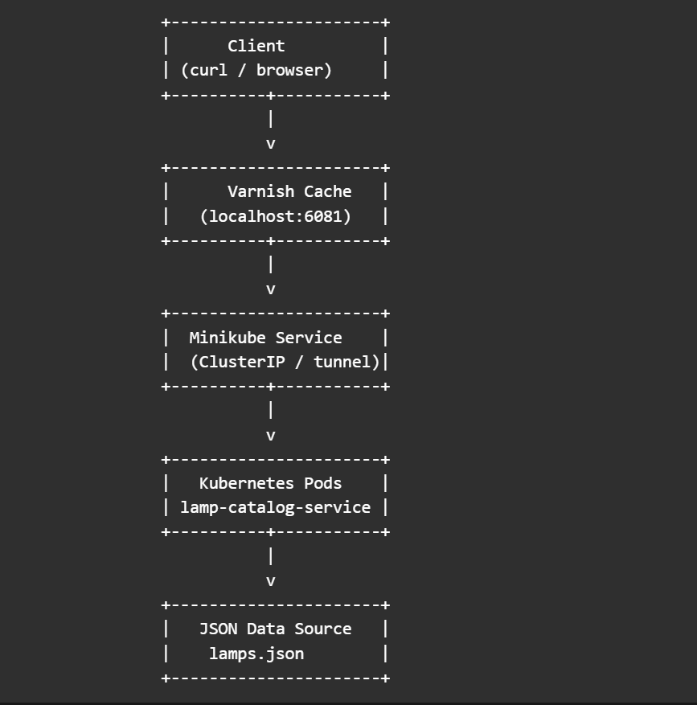

## Features
- Kubernetes deployment via Helm
- Horizontal Pod Autoscaling
- Secure container runtime
- Prometheus metrics exposed
- Varnish caching layer
- Terraform modular setup

## Run Locally
./setup.sh
./deploy.sh

## Access
http://lamp.local/api/v1/lamps


Here’s a clear, step-by-step guide to run your full solution locally on Minikube with Helm, Terraform (optional), and CI simulation.

🚀 0. Prerequisites

Make sure these are installed (setup.sh already checks this):

- Docker

- Minikube

- kubectl

- Helm

- Terraform

## Install kubectl
Run the following commands to install `kubectl`:

```bash
curl -LO "https://dl.k8s.io/release/$(curl -L -s https://dl.k8s.io/release/stable.txt)/bin/linux/amd64/kubectl"
chmod +x kubectl
sudo mv kubectl /usr/local/bin/
```

Verify:
```
kubectl version --client
```

## Install helm
```
curl https://raw.githubusercontent.com/helm/helm/main/scripts/get-helm-3 | bash
```

Verify:
```
helm version
```

## Install terraform
```
sudo apt-get update && sudo apt-get install -y gnupg software-properties-common

wget -O- https://apt.releases.hashicorp.com/gpg | \
gpg --dearmor | \
sudo tee /usr/share/keyrings/hashicorp-archive-keyring.gpg > /dev/null

echo "deb [signed-by=/usr/share/keyrings/hashicorp-archive-keyring.gpg] \
https://apt.releases.hashicorp.com $(lsb_release -cs) main" | \
sudo tee /etc/apt/sources.list.d/hashicorp.list

sudo apt update
sudo apt install terraform
```

Verify:
```
terraform version
```

## Install minikube
```
curl -LO https://storage.googleapis.com/minikube/releases/latest/minikube-linux-amd64
sudo install minikube-linux-amd64 /usr/local/bin/minikube
```

Verify:
```
minikube version
```

## Deployment Commands (Working)
# Build image
```
docker build -t lamp-catalog:latest ./starter-code/lamp-catalog-service
```
# Load into minikube
```
minikube image load lamp-catalog:latest
```
# Install Helm chart
```
helm install lamp ./helm/lamp-catalog
```
# Access service
```
minikube ip
```

##  🏗️ Architecture / Topology



🔍 Architecture Explanation
1. Client Layer
 - User interacts via:
    - curl
    - Browser
 - Requests are sent to Varnish (caching layer)

2. Caching Layer (Varnish)
 - Acts as a reverse proxy
 - Caches API responses
 - Reduces load on backend

 - Cache Strategy:
    - Cacheable endpoints:
        - GET /api/v1/lamps
        - GET /api/v1/lamps/{id}
 - TTL: 60 seconds
 - Bypass:
    - Non-GET requests
    - Future auth-based requests

3. Kubernetes Service (Minikube)
 - Type: ClusterIP
 - Exposes application internally
 - Accessed via:
    - Minikube tunnel
    - Ingress (lamp.local)

4. Application Layer (Pods)
 - FastAPI-based microservice
 - Features:
    - REST API
    - Prometheus metrics (/metrics)
    - Health endpoint (/healthz)

5. Data Layer
 - Static JSON file (lamps.json)
 - Simulates product catalog

## ⚙️ 1. Bootstrap Environment (Working)

From repo root:
```
chmod +x setup.sh
./setup.sh
```
This will:

- Start Minikube

- Set kubectl context

- Enable ingress + metrics-server

## 🐳 2. Build & Load Docker Image (Working)

Minikube needs the image locally:
```
cd starter-code/lamp-catalog-service

docker build -t lamp-catalog:latest .
```
# Load into Minikube
```
minikube image load lamp-catalog:latest
```

## 📦 3. Deploy Using Helm (Working)

Go back to root:
```
cd ../../
```
Install the Helm chart:
```
helm install lamp ./helm/lamp-catalog
```
Verify:
```
kubectl get pods
kubectl get svc
kubectl get ingress
```

## 🌐 4. Expose Service (Working)

Get Minikube IP:
```
minikube ip
```
Edit /etc/hosts:
```
sudo nano /etc/hosts
```
Add:
```
<MINIKUBE_IP> lamp.local
```

## 🧪 5. Test the Application (Working)
Health check
```
curl http://lamp.local/healthz
```
Get all lamps
```
curl http://lamp.local/api/v1/lamps
```
Get single lamp
```
curl http://lamp.local/api/v1/lamps/lamp-001
```

## 📈 6. Test Autoscaling (HPA)

Check HPA:
```
kubectl get hpa
```
Generate load:
```
kubectl run -i --tty load-generator --rm --image=busybox -- /bin/sh
```
Inside pod:
```
while true; do wget -q -O- http://lamp.local/api/v1/lamps; done
```
In another terminal:
```
kubectl get hpa -w
```

## 🧱 7. Run Terraform (Working)

Terraform is modeling infra (namespace etc.)
```
cd terraform

terraform init
terraform apply
```
Check:
```
kubectl get ns
```

## 🧪 8. Simulate CI/CD Locally

Run pipeline steps manually:

Lint
```
sudo apt install python3-pip
sudo apt install flake8
flake8 starter-code/lamp-catalog-service/app
```
Build
```
docker build -t lamp-catalog:latest starter-code/lamp-catalog-service
```
Deploy
```
helm upgrade --install lamp ./helm/lamp-catalog
```
